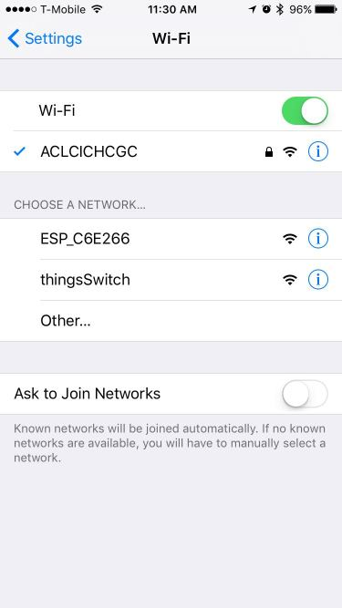

# thingsSwitch

__thingsSwitch__ is a simple way to connect an ESP8266 to an Amazon Echo.

## Installation 

To install thingsSwitch on your ESP8266:

1. [Download Flasher.js](https://github.com/thingsSDK/flasher.js/releases).
2. Select the _Serial Port_ from the drop
  1. If you don't see your device you may require drivers
3. Select the latest version of thingsSwitch from the _Binaries_ drop Download

## Configuration

1. Connect to _thingsSwitch_ WiFi hot spot
2. Configure your WiFi
3. Add a device name
4. Add a pin you want to switch on and off
5. Save configuration
6. Ask Alexa to "discover devices"
7. Tell Alexa to "turn <device name> on" or "turn <device name> off"

## Developer

Check out the [contributing doc](CONTRIBUTING.md).